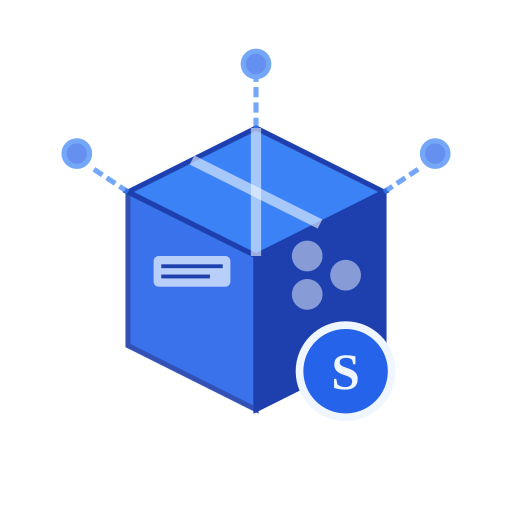

<div align="center">
  
  <h1>SkillHub</h1>
  <p>An enterprise-grade, open-source agent skill registry — publish, discover, and manage reusable skill packages across your organization.</p>
</div>

<div align="center">

[](https://deepwiki.com/iflytek/skillhub)
[](https://zread.ai/iflytek/skillhub)
[](./LICENSE)
[](https://github.com/iflytek/skillhub/actions/workflows/publish-images.yml)
[](https://ghcr.io/iflytek/skillhub)
[](https://openjdk.org/projects/jdk/21/)
[](https://react.dev)

</div>

<div align="center">

[English](./README.md) | [中文](./README_zh.md)

</div>

---

> Based on SkillHub, modified for internal use.

SkillHub is a self-hosted platform that gives teams a private,
governed place to share agent skills. Publish a skill package, push
it to a namespace, and let others find it through search or
install it via CLI. Built for on-premise deployment behind your
firewall, with the same polish you'd expect from a public registry.

📖 **[Full Documentation →](https://zread.ai/iflytek/skillhub)**

## Highlights

- **Self-Hosted & Private** — Deploy on your own infrastructure.
  Keep proprietary skills behind your firewall with full data
  sovereignty. One `make dev-all` command to get running locally.
- **Publish & Version** — Upload agent skill packages with semantic
  versioning, custom tags (`beta`, `stable`), and automatic
  `latest` tracking.
- **Discover** — Full-text search with filters by namespace,
  downloads, ratings, and recency. Visibility rules ensure
  users only see what they're authorized to.
- **Team Namespaces** — Organize skills under team or global scopes.
  Each namespace has its own members, roles (Owner / Admin /
  Member), and publishing policies.
- **Review & Governance** — Team admins review within their namespace;
  platform admins gate promotions to the global scope. Governance
  actions are audit-logged for compliance.
- **Social Features** — Star skills, rate them, and track downloads.
  Build a community around your organization's best practices.
- **Account Merging** — Consolidate multiple OAuth identities and
  API tokens under a single user account.
- **API Token Management** — Generate scoped tokens for CLI and
  programmatic access with prefix-based secure hashing.
- **CLI-First** — Native REST API plus a compatibility layer for
  existing ClawHub-style registry clients. Native CLI APIs are the
  primary supported path while protocol compatibility continues to
  expand.
- **Pluggable Storage** — Local filesystem for development and the
  temporary single-node production transition; S3 / MinIO is the
  recommended production target. Swap via config.
- **Internationalization** — Multi-language support with i18next.

## Quick Start

Start the full local stack with one of the following commands:

Official images:
```bash
rm -rf /tmp/skillhub-runtime
RUNTIME_URL=https://imageless.oss-cn-beijing.aliyuncs.com/runtime-github.sh
RUNTIME_FILE=/tmp/skillhub-runtime.sh
SHA256SUM_URL="${SHA256SUM_URL:-}"
SHA256SUM="${SHA256SUM:-}"
curl -fL "$RUNTIME_URL" -o "$RUNTIME_FILE"
if [ -n "$SHA256SUM_URL" ]; then
  curl -fL "$SHA256SUM_URL" -o "${RUNTIME_FILE}.sha256"
  (cd "$(dirname "$RUNTIME_FILE")" && sha256sum -c "$(basename "${RUNTIME_FILE}.sha256")")
elif [ -n "$SHA256SUM" ]; then
  printf '%s  %s\n' "$SHA256SUM" "$(basename "$RUNTIME_FILE")" |
    (cd "$(dirname "$RUNTIME_FILE")" && sha256sum -c -)
else
  echo "Set SHA256SUM_URL or SHA256SUM from a trusted release source before executing." >&2
  exit 1
fi
sh "$RUNTIME_FILE" up
```

The repository does not embed a checksum for this moving quick-start URL. Set
exactly one of `SHA256SUM_URL` (a trusted `sha256sum`-format file) or
`SHA256SUM` (the exact trusted SHA-256 value) before running the command. If
neither is available, stop after downloading and do not execute the script.

The runtime script is the local Quickstart path. It validates `.env.quickstart`
before starting; on the first run it downloads `.env.quickstart.example` into
the runtime directory and stops until the local passwords are set. Edit that
generated `.env.quickstart`, then run the command again. Quickstart uses local
storage, disables enterprise SSO, and targets `http://localhost`, so its
`SESSION_COOKIE_SECURE=false` setting is intentional. This template must not
be used for production.

The default command pulls the `latest` stable release images. Use
`--version edge` if you want the newest build from `main`.

Aliyun mirror shortcut:
```bash
rm -rf /tmp/skillhub-aliyun
RUNTIME_URL=https://imageless.oss-cn-beijing.aliyuncs.com/runtime.sh
RUNTIME_FILE=/tmp/skillhub-aliyun-runtime.sh
curl -fL "$RUNTIME_URL" -o "$RUNTIME_FILE"
# Set SHA256SUM_URL or SHA256SUM using the same verification flow above.
echo "Verify $RUNTIME_FILE with a trusted SHA-256 checksum before executing it."
```

For the Aliyun mirror, set `SKILLHUB_ALIYUN_REGISTRY` and
`SKILLHUB_ALIYUN_NAMESPACE` explicitly before using `--aliyun`; the repository
does not publish a private registry hostname.

After verification, execute the selected script explicitly:

```bash
sh /tmp/skillhub-aliyun-runtime.sh up --home /tmp/skillhub-aliyun --aliyun --version latest
```

Do not execute the downloaded mirror script if it has not been checksum-verified.

If deployment runs into problems, clear the existing runtime home and retry.

### Prerequisites

- Docker & Docker Compose

### Local Development

```bash
make dev-all
```

Then open:

- Web UI: `http://localhost:3000`
- Backend API: `http://localhost:8080`

By default, `make dev-all` starts the backend with the `local` profile.
In that mode, local development keeps the mock-auth users below and also
creates a password-based bootstrap admin account by default:

- `local-user` for normal publishing and namespace operations
- `local-admin` with `SUPER_ADMIN` for review and admin flows

Use them with the `X-Mock-User-Id` header in local development.

The local bootstrap admin is enabled by default in `application-local.yml`:

- username: `admin`
- password: `ChangeMe!2026`
- To disable it, set `BOOTSTRAP_ADMIN_ENABLED=false` before starting the backend.

Stop everything with:

```bash
make dev-all-down
```

Reset local dependencies and start from a clean slate with:

```bash
make dev-all-reset
```

Run `make help` to see all available commands.

Useful backend commands:

```bash
make test
make test-backend-app
make build-backend-app
```

Do not run `./mvnw -pl skillhub-app clean test` directly under `server/`.
`skillhub-app` depends on sibling modules in the same repo, and a standalone clean build
can fall back to stale artifacts from the local Maven repository, which surfaces misleading
`cannot find symbol` and signature-mismatch errors. Use `-am`, or the `make test-backend-app`
and `make build-backend-app` targets above.

For the full development workflow (local dev → staging → PR), see [docs/dev-workflow.md](docs/dev-workflow.md).

### API Contract Sync

OpenAPI types for the web client are checked into the repository.
When backend API contracts change, regenerate the SDK and commit the
updated generated file:

```bash
make generate-api
```

For a stricter end-to-end drift check, run:

```bash
./scripts/check-openapi-generated.sh
```

This starts local dependencies, boots the backend, regenerates the
frontend schema, and fails if the checked-in SDK is stale.

### Container Runtime

Published runtime images are built by GitHub Actions and pushed to GHCR.
This is the supported path for anyone who wants a ready-to-use local
environment without building the backend or frontend on their machine.
Published images target both `linux/amd64` and `linux/arm64`.

1. Copy the runtime environment template.
2. Pick an image tag.
3. Start the stack with Docker Compose.

```bash
cp .env.quickstart.example .env.quickstart
# Set BOOTSTRAP_ADMIN_PASSWORD and POSTGRES_PASSWORD in .env.quickstart first.
```

Recommended image tags:

- `SKILLHUB_VERSION=edge` for the latest `main` build
- `SKILLHUB_VERSION=vX.Y.Z` for a fixed release

Start the runtime:

```bash
make validate-release-config RELEASE_ENV_FILE=.env.quickstart
docker compose --env-file .env.quickstart -f compose.release.yml up -d
```

Then open:

- Web UI: `SKILLHUB_PUBLIC_BASE_URL` 对应的地址
- Backend API: `http://localhost:8080`

Stop it with:

```bash
docker compose --env-file .env.quickstart -f compose.release.yml down
```

The runtime stack uses its own Compose project name, so it does not
collide with containers from `make dev-all`.

The Quickstart Compose stack defaults to the `docker` profile only.
It does not enable local mock auth. Production and staging require an explicit
`BOOTSTRAP_ADMIN_PASSWORD` whenever bootstrap admin is enabled; there is no
production default password. The local source `local` profile is the only mode
that retains the documented `admin` / `ChangeMe!2026` convenience account.

Quickstart uses GHCR images by default and binds the API port to loopback on
the host. If either scanner is enabled in the env file, the downloaded
`runtime.sh` activates the matching Compose profile automatically. With a
direct Compose command, set `COMPOSE_PROFILES=secret-scan` and/or
`COMPOSE_PROFILES=unified-scan` explicitly.

For production, start from `.env.release.example`, copy it to `.env.release`,
set the final HTTPS URL and real secrets, and validate it with
`make validate-release-config RELEASE_ENV_FILE=.env.release`. Production must
keep `SESSION_COOKIE_SECURE=true` and disable local registration. S3/OSS is
recommended; temporary local storage is allowed only for a single-node
transition with Docker volume backups and no horizontal scaling.

Recommended production baseline:

- set `SKILLHUB_PUBLIC_BASE_URL` to the final HTTPS entrypoint
- keep PostgreSQL / Redis bound to `127.0.0.1`
- use external S3 / OSS via `SKILLHUB_STORAGE_S3_*`
- set `BOOTSTRAP_ADMIN_PASSWORD` to a unique strong password (`validate-release-config.sh` rejects example/default values)
- rotate or disable the bootstrap admin after initial setup
- run `make validate-release-config RELEASE_ENV_FILE=.env.release` before `docker compose up -d`

If the GHCR package remains private, run `docker login ghcr.io` before
`docker compose up -d`.

### Monitoring

A Prometheus + Grafana monitoring stack lives under [`monitoring/`](./monitoring).
It scrapes the backend's Actuator Prometheus endpoint.

Start it with:

```bash
cd monitoring
docker compose -f docker-compose.monitoring.yml up -d
```

Then open:

- Prometheus: `http://localhost:9090`
- Grafana: `http://localhost:3001` (set `GF_SECURITY_ADMIN_PASSWORD` explicitly)

By default Prometheus scrapes `http://host.docker.internal:8080/actuator/prometheus`,
so start the backend locally on port `8080` first.

## Kubernetes

Basic Kubernetes manifests are available under [`deploy/k8s/`](./deploy/k8s):

- `configmap.yaml`
- `secret.yaml.example`
- `backend-deployment.yaml`
- `frontend-deployment.yaml`
- `services.yaml`
- `ingress.yaml`

Apply them after creating your own secret:

```bash
kubectl apply -f deploy/k8s/configmap.yaml
kubectl apply -f deploy/k8s/secret.yaml
kubectl apply -f deploy/k8s/backend-deployment.yaml
kubectl apply -f deploy/k8s/frontend-deployment.yaml
kubectl apply -f deploy/k8s/services.yaml
kubectl apply -f deploy/k8s/ingress.yaml
```

## Smoke Test

A lightweight smoke test script is available at [`scripts/smoke-test.sh`](./scripts/smoke-test.sh).

Run it against a local backend:

```bash
./scripts/smoke-test.sh http://localhost:8080
```

## Architecture

```
┌─────────────┐     ┌─────────────┐     ┌──────────────┐
│   Web UI    │     │  CLI Tools  │     │  REST API    │
│  (React 19) │     │             │     │              │
└──────┬──────┘     └──────┬──────┘     └──────┬───────┘
       │                   │                   │
       └───────────────────┼───────────────────┘
                           │
                    ┌──────▼──────┐
                    │   Nginx     │
                    └──────┬──────┘
                           │
                    ┌──────▼──────┐
                    │ Spring Boot │  Auth · RBAC · Core Services
                    │   (Java 21) │  OAuth2 · API Tokens · Audit
                    └──────┬──────┘
                           │
              ┌────────────┼────────────┐
              │            │            │
       ┌──────▼───┐  ┌─────▼────┐  ┌────▼────┐
       │PostgreSQL│  │  Redis   │  │ Storage │
       │    16    │  │    7     │  │ S3/MinIO│
       └──────────┘  └──────────┘  └─────────┘
```

**Backend (Spring Boot 3.2.3, Java 21):**
- Multi-module Maven project with clean architecture
- Modules: app, domain, auth, search, storage, infra
- PostgreSQL 16 with Flyway migrations
- Redis for session management
- S3/MinIO for skill package storage

**Frontend (React 19, TypeScript, Vite):**
- TanStack Router for routing
- TanStack Query for data fetching
- Tailwind CSS + Radix UI for styling
- OpenAPI TypeScript for type-safe API client
- i18next for internationalization

## Usage with Agent Platforms

SkillHub works as a skill registry backend for several agent platforms. Point any of the clients below at your SkillHub instance to publish, discover, and install skills.

### [OpenClaw](https://github.com/openclaw/openclaw)

[OpenClaw](https://github.com/openclaw/openclaw) is an open-source agent skill CLI. Configure it to use your SkillHub endpoint as the registry:

```bash
# Configure registry URL
export CLAWHUB_REGISTRY=https://skillhub.your-company.com

# Authenticate once if needed
clawhub login --token YOUR_API_TOKEN

# Search and install skills
npx clawhub search email
npx clawhub install my-skill
npx clawhub install my-namespace--my-skill

# Publish a skill
npx clawhub publish ./my-skill
```

📖 **[Complete OpenClaw Integration Guide →](./docs/openclaw-integration.md)**

### [AstronClaw](https://agent.xfyun.cn/astron-claw)

[AstronClaw](https://agent.xfyun.cn/astron-claw) is a cloud AI assistant built on OpenClaw's core capabilities, providing 24/7 online service through enterprise platforms like WeChat Work, DingTalk, and Feishu. It features a built-in skill system with over 130 official skills. You can connect it to a self-hosted SkillHub registry to enable one-click skill installation, search repository, dialogue-based automatic installation, and even custom skills management within your organization.

### [Loomy](https://loomy.xunfei.cn/)

[Loomy](https://loomy.xunfei.cn/) is a desktop AI work partner focusing on real office scenarios. It integrates deeply with local files and system tools to build efficient automated workflows for individuals and small teams. By connecting Loomy to your SkillHub registry, you can easily discover and install organization-specific skills to enhance your local desktop automation and productivity.

### [astron-agent](https://github.com/iflytek/astron-agent)

[astron-agent](https://github.com/iflytek/astron-agent) is the iFlytek Astron agent framework. Skills stored in SkillHub can be referenced and loaded by astron-agent, enabling a governed, versioned skill lifecycle from development to production.

---

> 🌟 **Show & Tell** — Have you built something with SkillHub? We'd love to hear about it!
> Share your use case, integration, or deployment story in the
> [**Discussions → Show and Tell**](https://github.com/iflytek/skillhub/discussions/categories/show-and-tell) category.

## Contributing

Contributions are welcome. Please open an issue first to discuss
what you'd like to change.

- Contribution guide: [`CONTRIBUTING.md`](./CONTRIBUTING.md)
- Code of conduct: [`CODE_OF_CONDUCT.md`](./CODE_OF_CONDUCT.md)

## 📞 Support

- 💬 **Community Discussion**: [GitHub Discussions](https://github.com/iflytek/skillhub/discussions)
- 🐛 **Bug Reports**: [Issues](https://github.com/iflytek/skillhub/issues)
- 👥 **WeChat Work Group**:

  

## License

Apache License 2.0
